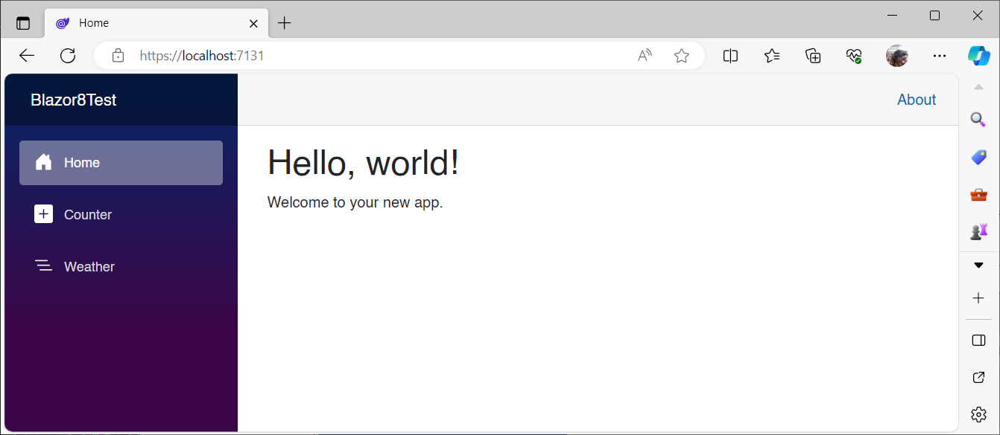
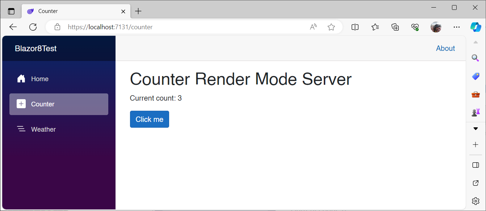
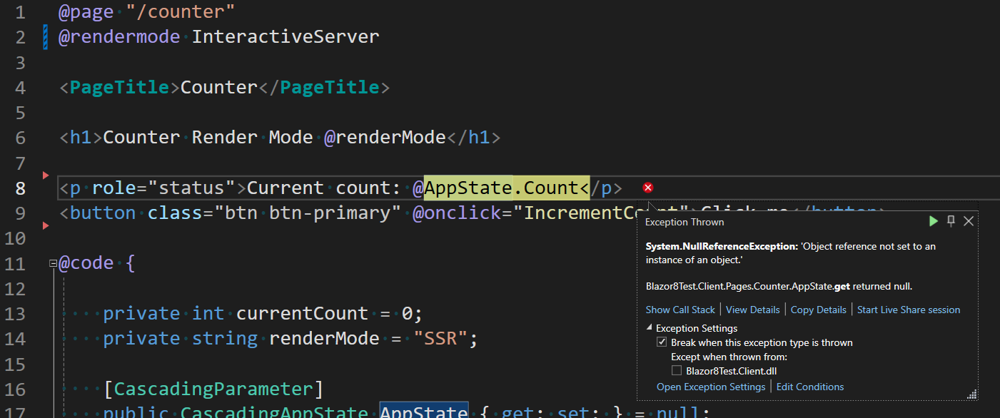

# Using per page/component render modes, cascading parameters turn null after rendering.

This is a .NET 8 Blazor Web App with the Interactive Render Mode set to Server, and the Interactivity Location set to Global.

This is my version info:

```
Microsoft Visual Studio Professional 2022
Version 17.8.5
VisualStudio.17.Release/17.8.5+34511.84
Microsoft .NET Framework
Version 4.8.09037

Installed Version: Professional

ASP.NET and Web Tools   17.8.358.6298
ASP.NET and Web Tools

Azure App Service Tools v3.0.0   17.8.358.6298
Azure App Service Tools v3.0.0

Azure Functions and Web Jobs Tools   17.8.358.6298
Azure Functions and Web Jobs Tools

C# Tools   4.8.0-7.23572.1+7b75981cf3bd520b86ec4ed00ec156c8bc48e4eb
C# components used in the IDE. Depending on your project type and settings, a different version of the compiler may be used.

Common Azure Tools   1.10
Provides common services for use by Azure Mobile Services and Microsoft Azure Tools.

DevExpress Dashboard Extension   1.4
A Visual Studio extension that invokes the Dashboard Designer editor.

DevExpress Reporting Extension   1.4
A Visual Studio extension that invokes the Report Designer editor for report definition VSREPX files.

DevExpress Reporting Tools Extension   1.0
Extends Visual Studio with tools required for the Report Designer editor.

DevExpress VSDesigner NETFramework Package   1.0
A Visual Studio extension that invokes the Report and Dashboard designer editors.

DevExpress.DeploymentTool   1.0
A useful tool for deploying DevExpress assemblies.

DevExpress.Win.LayoutAssistant Extension   1.0
DevExpress.Win.LayoutAssistant Visual Studio Extension Detailed Info

Extensibility Message Bus   1.4.39 (main@e8108eb)
Provides common messaging-based MEF services for loosely coupled Visual Studio extension components communication and integration.

GitHub Copilot   1.149.0.0 (v1.149.0.0@9a0f75deb)
GitHub Copilot is an AI pair programmer that helps you write code faster and with less work.

GitHub Copilot Agent   1.149.0

Microsoft JVM Debugger   1.0
Provides support for connecting the Visual Studio debugger to JDWP compatible Java Virtual Machines

Mono Debugging for Visual Studio   17.8.17 (957fbed)
Support for debugging Mono processes with Visual Studio.

NuGet Package Manager   6.8.0
NuGet Package Manager in Visual Studio. For more information about NuGet, visit https://docs.nuget.org/

Razor (ASP.NET Core)   17.8.3.2405201+d135dd8d2ec1c2fbdee220e8656b308694e17a4b
Provides languages services for ASP.NET Core Razor.

SQL Server Data Tools   17.8.120.1
Microsoft SQL Server Data Tools

TypeScript Tools   17.0.20920.2001
TypeScript Tools for Microsoft Visual Studio

Visual Basic Tools   4.8.0-7.23572.1+7b75981cf3bd520b86ec4ed00ec156c8bc48e4eb
Visual Basic components used in the IDE. Depending on your project type and settings, a different version of the compiler may be used.

Visual F# Tools   17.8.0-beta.23475.2+10f956e631a1efc0f7f5e49c626c494cd32b1f50
Microsoft Visual F# Tools

Visual Studio IntelliCode   2.2
AI-assisted development for Visual Studio.

VisualStudio.DeviceLog   1.0
Information about my package

VisualStudio.Mac   1.0
Mac Extension for Visual Studio

VSPackage Extension   1.0
VSPackage Visual Studio Extension Detailed Info

Xamarin   17.8.0.157 (d17-8@8e82278)
Visual Studio extension to enable development for Xamarin.iOS and Xamarin.Android.

Xamarin Designer   17.8.3.6 (remotes/origin/d17-8@eccf46a291)
Visual Studio extension to enable Xamarin Designer tools in Visual Studio.

Xamarin.Android SDK   13.2.2.0 (d17-5/45b0e14)
Xamarin.Android Reference Assemblies and MSBuild support.
    Mono: d9a6e87
    Java.Interop: xamarin/java.interop/d17-5@149d70fe
    SQLite: xamarin/sqlite/3.40.1@68c69d8
    Xamarin.Android Tools: xamarin/xamarin-android-tools/d17-5@ca1552d

```

In *App.razor*, I have disabled pre-rendering, but it also fails with pre-rendering on.

```html
<!DOCTYPE html>
<html lang="en">

<head>
    <meta charset="utf-8" />
    <meta name="viewport" content="width=device-width, initial-scale=1.0" />
    <base href="/" />
    <link rel="stylesheet" href="bootstrap/bootstrap.min.css" />
    <link rel="stylesheet" href="app.css" />
    <link rel="stylesheet" href="Blazor8Test.styles.css" />
    <link rel="icon" type="image/png" href="favicon.png" />
    <HeadOutlet @rendermode="@InteractiveServer" />
</head>

<body>
    <!-- Turn off pre-rendering -->
    <Routes @rendermode="@(new InteractiveServerRenderMode(false))" />
    <script src="_framework/blazor.web.js"></script>
</body>

</html>
```

I have a component in the client project called *CascadingAppState.razor*:

```xml
<CascadingValue Value="this">
    @ChildContent
</CascadingValue>
```

```c#
using Microsoft.AspNetCore.Components;

namespace Blazor8Test.Client;

public partial class CascadingAppState : ComponentBase
{
    [Parameter]
    public RenderFragment ChildContent { get; set; }

    private int count = 0;
    public int Count
    {
        get => count;
        set
        {
            count = value;
            StateHasChanged();
        }
    }
}
```

I have modified *Routes.razor* as follows:

```xml
<CascadingAppState>
    <Router AppAssembly="@typeof(Program).Assembly">
        <Found Context="routeData">
            <RouteView RouteData="@routeData" DefaultLayout="@typeof(Layout.MainLayout)" />
            <FocusOnNavigate RouteData="@routeData" Selector="h1" />
        </Found>
    </Router>
</CascadingAppState>
```

I have implemented `CascadingAppState` in *Counter.razor*:

```c#
@page "/counter"

<PageTitle>Counter</PageTitle>

<h1>Counter Render Mode @renderMode</h1>

<p role="status">Current count: @AppState.Count</p>
<button class="btn btn-primary" @onclick="IncrementCount">Click me</button>

@code {

    private int currentCount = 0;
    private string renderMode = "SSR";

    [CascadingParameter]
    public CascadingAppState AppState { get; set; } = null;

    private void IncrementCount()
    {
        AppState.Count++;
    }

    protected override void OnAfterRender(bool firstRender)
    {
        if (firstRender)
        {
            renderMode = OperatingSystem.IsBrowser() ? "Wasm" : "Server";
            StateHasChanged();
        }
    }
}
```

Note that I am also showing the current render mode: SSR, Server, or WASM.

## Behavior

Run the app and navigate to the Counter page. It works as advertised




Increment the counter, navigate to Home and back. The value persists because of the Cascading App State:




Now remove the "Global" feature in *App.razor*:

```xml
<!DOCTYPE html>
<html lang="en">

<head>
    <meta charset="utf-8" />
    <meta name="viewport" content="width=device-width, initial-scale=1.0" />
    <base href="/" />
    <link rel="stylesheet" href="bootstrap/bootstrap.min.css" />
    <link rel="stylesheet" href="app.css" />
    <link rel="stylesheet" href="Blazor8Test.styles.css" />
    <link rel="icon" type="image/png" href="favicon.png" />
    <HeadOutlet />
</head>

<body>
    <Routes />
    <script src="_framework/blazor.web.js"></script>
</body>

</html>
```

And add this line on line 2 of *Counter.razor*:

```c#
@rendermode InteractiveServer
```

Run it again


Upon navigation, you get a Null Reference Exception on AppState:

