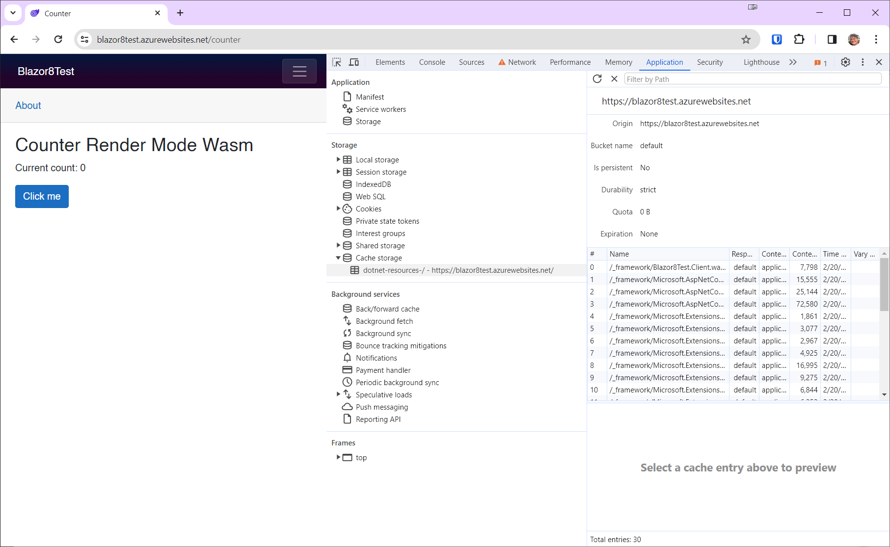

# .NET 8 Blazor Web App in Global Auto Mode Now Working Correctly

After upgrading Visual Studio to version 17.9.0, the following app renders correctly.

This issue is documented on GitHub at https://github.com/dotnet/aspnetcore/issues/52154

The problem was that when using Auto Render mode with Global interactivity, the page would be unresponsive until the WebAssembly bits had been downloaded. This little glitch rendered Auto Render mode to become irrelevant, because the behavior was exactly like WebAssembly Render mode. In other words, the Blazor Server mechanism never kicked in.

I have published this project on Azure, and you can run it at https://blazor8test.azurewebsites.net

Navigate to the Counter page. The render mode is shown as either **SSR**, **Server**, or **Wasm**.

This is how I built the app. First, *Program.cs* on the server side.

*Program.cs:*

```c#
using Blazor8Test.Client.Pages;
using Blazor8Test.Components;

var builder = WebApplication.CreateBuilder(args);

// Add services to the container.
builder.Services.AddRazorComponents()
    .AddInteractiveServerComponents()
    .AddInteractiveWebAssemblyComponents();

var app = builder.Build();

// Configure the HTTP request pipeline.
if (app.Environment.IsDevelopment())
{
    app.UseWebAssemblyDebugging();
}
else
{
    app.UseExceptionHandler("/Error", createScopeForErrors: true);
    // The default HSTS value is 30 days. You may want to change this for production scenarios, see https://aka.ms/aspnetcore-hsts.
    app.UseHsts();
}

app.UseHttpsRedirection();

app.UseStaticFiles();
app.UseAntiforgery();

app.MapRazorComponents<App>()
    .AddInteractiveServerRenderMode()
    .AddInteractiveWebAssemblyRenderMode()
    .AddAdditionalAssemblies(typeof(Blazor8Test.Client._Imports).Assembly);

app.Run();
```

This is typical of a Blazor Web App with Auto mode.

Next, the *App.razor* file ensures that the render mode will be global:

```html
<!DOCTYPE html>
<html lang="en">

<head>
    <meta charset="utf-8" />
    <meta name="viewport" content="width=device-width, initial-scale=1.0" />
    <base href="/" />
    <link rel="stylesheet" href="bootstrap/bootstrap.min.css" />
    <link rel="stylesheet" href="app.css" />
    <link rel="stylesheet" href="Blazor8Test.styles.css" />
    <link rel="icon" type="image/png" href="favicon.png" />
    <HeadOutlet @rendermode="InteractiveAuto" />
</head>

<body>
    <Routes @rendermode="InteractiveAuto" />
    <script src="_framework/blazor.web.js"></script>
</body>

</html>
```

The `@rendermode` attribute ensures global rendering.

Next, I created a Cascading AppState component in the client project.

*CascadingAppState.razor*:

```xml
<CascadingValue Value="this">
    @ChildContent
</CascadingValue>
```

*CascadingAppState.razor.cs*:

```c#
using Microsoft.AspNetCore.Components;

namespace Blazor8Test.Client;

public partial class CascadingAppState : ComponentBase
{
    [Parameter]
    public RenderFragment ChildContent { get; set; }

    private int count = 0;
    public int Count
    {
        get => count;
        set
        {
            count = value;
            StateHasChanged();
        }
    }
}
```

In *Routes.razor*, I encapsulated the app in my CascadingAppState component:

*Routes.razor*:

```xml
<CascadingAppState>
    <Router AppAssembly="@typeof(Program).Assembly">
        <Found Context="routeData">
            <RouteView RouteData="@routeData" DefaultLayout="@typeof(Layout.MainLayout)" />
            <FocusOnNavigate RouteData="@routeData" Selector="h1" />
        </Found>
    </Router>
</CascadingAppState>
```

Next, I modified *Counter.razor* to show the render mode and use the CascadingAppState parameter.

*Counter.razor*:

```c#
@page "/counter"

<PageTitle>Counter</PageTitle>

<h1>Counter Render Mode @renderMode</h1>

<p role="status">Current count: @AppState.Count</p>
<button class="btn btn-primary" @onclick="IncrementCount">Click me</button>

@code {

    private int currentCount = 0;
    private string renderMode = "SSR";

    [CascadingParameter]
    public CascadingAppState AppState { get; set; } = null;

    private void IncrementCount()
    {
        AppState.Count++;
    }

    protected override void OnAfterRender(bool firstRender)
    {
        if (firstRender)
        {
            renderMode = OperatingSystem.IsBrowser() ? "Wasm" : "Server";
            StateHasChanged();
        }
    }
}
```

When you run this app and navigate to the Counter page. 

The app should load immediately, and the Counter page should show the initial render mode as **Server**.

It will remain in **Server** mode until you refresh the page.

At that time you will first see the render mode as **SSR** (server-side rendering) because of the pre-rendering stage. After a few seconds it will update to **Wasm**.

## Testing

To test, navigate to https://blazor8test.azurewebsites.net/ in your browser.

Bring up the dev tools and select **Application**, and then expand **Cache storage** under **Storage**. You will most likely see the WebAssembly files in there.


Navigate to the Counter page.

Now, right-click on **dotnet-resources** and select **Delete**.


Your screen should look like this:


Now right-click on the browser refresh button and select **Empty Cache and Hard Reload**:


As the Wasm files are downloading, you will see the render mode is **SSR**:


Once all the files have been loaded, the render mode switches to **Wasm**:

